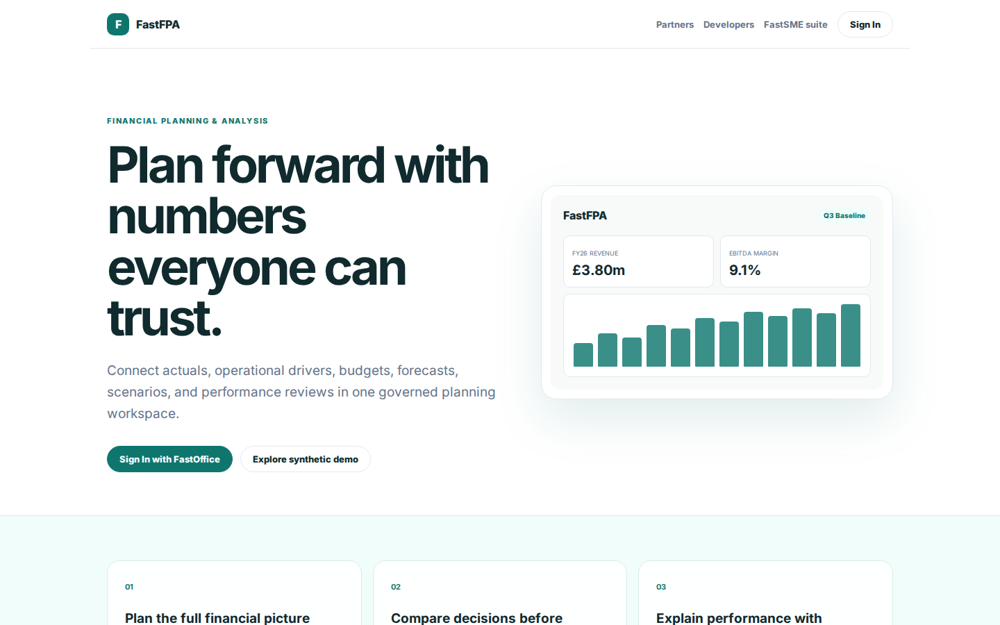
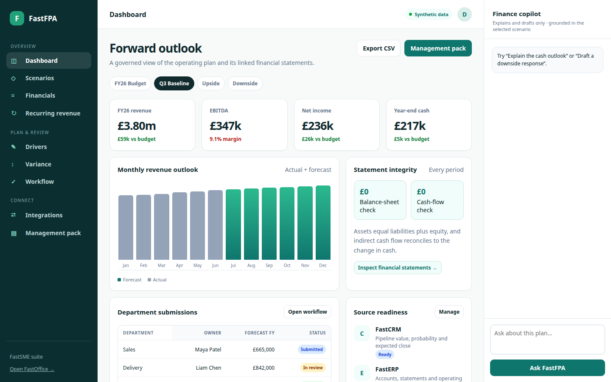
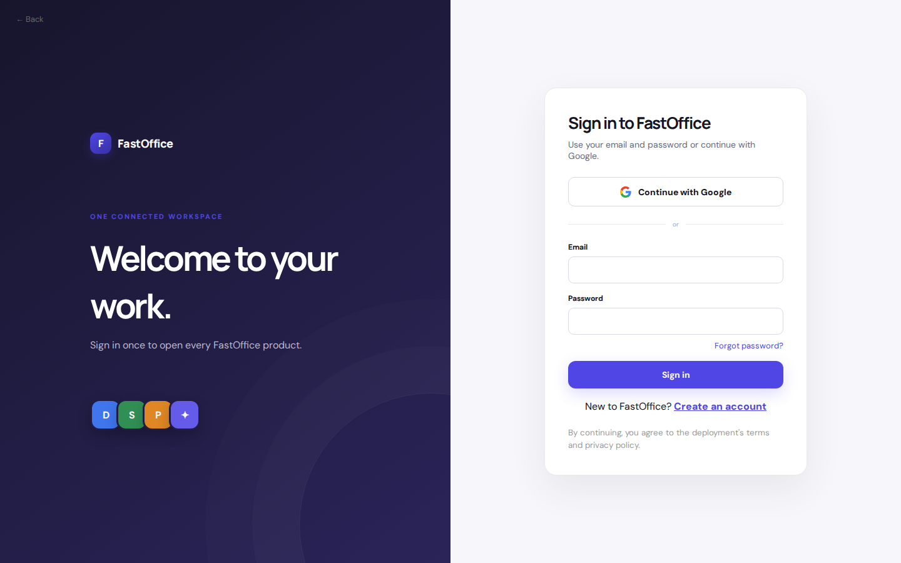

# FastFPA Platform Guide

**Published:** 2026-08-19
**Platform:** [https://fpa.fastsme.com](https://fpa.fastsme.com)
**Source:** [github.com/predictivelabsai/FastFPA](https://github.com/predictivelabsai/FastFPA)

## Platform overview

FastFPA is the open-source financial planning and analysis application in the FastSME suite. It combines driver-based budgets, rolling forecasts, scenarios, variance analysis, workflow, and linked P&L, balance sheet, and cash flow.

This visual guide was reviewed against the live product using Playwright. Screens and available navigation can vary by account, role, and deployment configuration.

## 1. Plan forward with numbers everyone can trust.

FINANCIAL PLANNING & ANALYSIS Plan forward with numbers everyone can trust. Connect actuals, operational drivers, budgets, forecasts, scenarios, and performance reviews in one governed planning workspace. Sign In with FastOffice Explore synthetic demo FastFPA

Screen reviewed at: [https://fpa.fastsme.com/](https://fpa.fastsme.com/)

## 2. Forward outlook

Dashboard Synthetic data D Forward outlook A governed view of the operating plan and its linked financial statements. Export CSV Management pack FY26 Budget Q3 Baseline Upside Downside FY26 revenue £3.80m £59k vs budget EBITDA £347k 9.1% margin Net income £236

Screen reviewed at: [https://fpa.fastsme.com/](https://fpa.fastsme.com/)

## 3. Forward outlook

Dashboard Synthetic data D Forward outlook A governed view of the operating plan and its linked financial statements. Export CSV Management pack FY26 Budget Q3 Baseline Upside Downside FY26 revenue £3.80m £59k vs budget EBITDA £347k 9.1% margin Net income £236

Screen reviewed at: [https://fpa.fastsme.com/](https://fpa.fastsme.com/)

## 4. Welcome to your work.

← Back F FastOffice ONE CONNECTED WORKSPACE Welcome to your work. Sign in once to open every FastOffice product. D S P ✦ Sign in to FastOffice Use your email and password or continue with Google. Continue with Google or Email Password Forgot password? Sign in

Screen reviewed at: [https://office.fastsme.com/login?next=/launch/fpa](https://office.fastsme.com/login?next=/launch/fpa)

## Getting started

Visit [https://fpa.fastsme.com](https://fpa.fastsme.com) to explore FastFPA. For source code and deployment details, use the GitHub link above.
